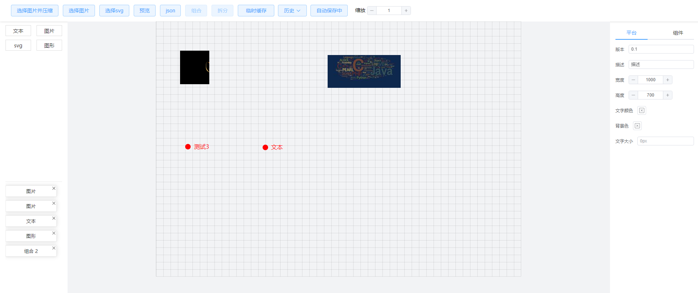
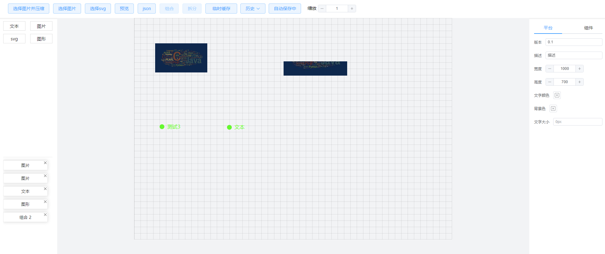

vue3的拖拽
按下ctrl键选中节点，可保持节点不失活，可多选、可修改右侧功能。
按space可全部拖拽。动态控制属性

    todo: 
    1、文字宽高自适应时 组合时贴边计算存在误差
    2、多条逻辑
        
预览
https://renqiankun.github.io/vue3-drag-panel/dist/index.html

仅预览安装  
    
    npm i drag-pannel-preview

    <drag-pannel-preview :pannel="pannel" v-model="data" />
  
  
